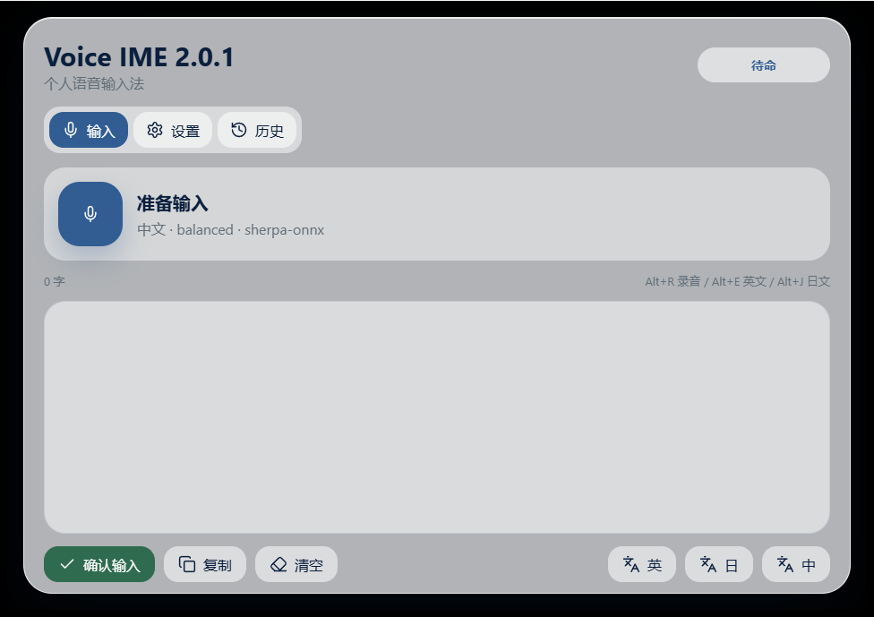

# Voice IME Rust 2.0.1

Voice IME 是一个 Windows 优先的本地语音输入工具，使用 Rust + Tauri 2 重写。它把语音先转成确认栏文本或光标旁浮窗内容，用户确认后再粘贴到当前应用，不会自动发送回车。



## 主要能力

- 本地 ASR 转写：默认使用 `sherpa-onnx`，支持 `fast`、`balanced`、`fallback` 三个内置档位，并预留 `accurate` 外部命令实验档。
- 光标旁浮窗：能定位光标时在光标附近显示结果，定位失败时回到主窗口确认栏。
- 确认后输入：点击确认后恢复目标窗口焦点并粘贴文本，不自动发送。
- 按住说话：默认按住 `CapsLock` 或鼠标 `X2` 开始录音，松开后转写。
- 麦克风选择与电平：主界面显示输入电平，设置页可选择系统默认或指定麦克风。
- 智能纠错与翻译：可连接本地 OpenAI-compatible `llama-server`，用于纠错、改写和中日英翻译。
- 便携运行：发布包根目录只保留 `启动语音输入.bat`，主体程序和模型放在隐藏的 `app` 目录里。

## 下载与运行

GitHub Release 推荐提供这些资产：

- `voice-ime-2.0.1-rust-portable.zip`：完整测试包，包含当前本机模型缓存。
- `voice-ime-2.0.1-rust-portable-core.zip`：轻主体包，不含大模型，适合拷到单位或移动硬盘测试。
- `voice-ime-model-pack-*.zip`：单独模型包，可在“设置 / 模型 / 导入包”里导入。
- `voice-ime-release-assets-2.0.1.json`：发布资产 SHA-256 清单。

便携版解压后，双击根目录里的：

```text
启动语音输入.bat
```

也可以用 PowerShell 启动：

```powershell
Set-Location D:\voice-ime-build-release\voice-ime-2.0.1-rust-portable
& .\启动语音输入.bat
```

启动后会打开毛玻璃主窗口。第一次使用建议先看主界面的“输入电平”是否会跳动，再进入“设置”页确认 ASR 模型状态是否为 ready。

## 基本用法

1. 打开需要输入文字的软件，例如记事本、浏览器输入框、聊天窗口或文档编辑器。
2. 确认主界面的“输入电平”会随说话跳动；如果不动，进入“设置 / 语音”切换麦克风。
3. 按住 `CapsLock` 或鼠标 `X2` 开始说话，松开后停止录音。
4. 也可以点击 Voice IME 主窗口里的麦克风按钮，或按 `Alt+R` 切换开始/停止。
5. 等待转写结果出现在光标旁浮窗或主窗口确认栏。
6. 检查文本，必要时手动修改。
7. 点击“确认输入”，文本会粘贴到刚才的目标窗口。

清空或重新开始录音会取消当前会话；旧转写、纠错或翻译结果不会再覆盖当前确认栏。

常用快捷键：

| 快捷键 | 作用 |
| --- | --- |
| 按住 `CapsLock` / 鼠标 `X2` | 长按录音，松开转写 |
| `Alt+R` | 开始或停止录音 |
| `Alt+Space` | 切换识别语言 |
| `Alt+E` | 将确认栏文本翻译为英文 |
| `Alt+J` | 将确认栏文本翻译为日文 |

如果快捷键注册失败，主窗口按钮仍然可以正常使用；进入“设置 / 快捷键”可以点键盘按钮录入组合键，也可以手动编辑。保存后会立即重新注册，并在页面里显示每个全局热键的状态。`CapsLock` 作为按住说话键时，短按会补发原按键，超过“长按阈值”才开始录音。

## 模型放置

ASR 模型默认放在便携包的：

```text
app/models/
```

需要的目录结构：

```text
app/models/
  sherpa-onnx-sense-voice-zh-en-ja-ko-yue-int8-2024-07-17/
    model.int8.onnx
    tokens.txt
  sherpa-onnx-zipformer-ctc-zh-int8-2025-07-03/
    model.int8.onnx
    tokens.txt
  sherpa-onnx-whisper-tiny/
    tiny-encoder.int8.onnx
    tiny-decoder.int8.onnx
    tiny-tokens.txt
```

设置页提供“下载”“选择”“导入包”“镜像”“官网”“模型目录”按钮。模型放在移动硬盘或外部目录时，先设置“模型根目录”，再点对应 profile 的“选择”挑该模型目录并自动填入默认文件名；已有 `voice-ime-model-pack-*.zip` 时，点“导入包”会把包内 `app/models` 或 `models` 内容合并到当前有效模型根目录，新格式模型包会先校验 SHA-256 和文件大小。每个模型路径右侧也有文件按钮，可单独选择 `onnx` 或 `tokens.txt`。下载会优先尝试 `hf-mirror.com`，失败后再尝试 `huggingface.co`。

多台电脑共用同一份模型仓库时，可以用三种方式指定模型根目录：系统环境变量 `VOICE_IME_MODEL_DIR`、设置页“模型根目录”，或 `app\MODEL_ROOT.txt`。设置页“模型”里会显示当前来源，并提供“写入便携”“清除”按钮，用当前模型根目录生成或删除 `MODEL_ROOT.txt`；后端、启动脚本、诊断、托盘菜单“模型目录”和 MiniCPM 启动脚本都会读取它，并指向同一个有效目录。主体包自带的 `app\models\MODELS.json/md` 始终保留为清单和修复来源，不会因为外置模型根而被混淆。

## 智能纠错和翻译

智能纠错依赖本地 `llama-server`。翻译默认也走本地 LLM，但设置页可以把“翻译引擎”切到 `external`，接入 NLLB、Bergamot 或其他本地机器翻译命令。外部翻译支持 `fast`、`balanced`、`accurate` 和 `custom` 档位，每个档位可以配置独立命令；没有配置分档命令时会回退到旧的“外部翻译命令”。

默认端点是：

```text
http://127.0.0.1:18080/v1/chat/completions
```

便携包可选包含：

```text
app/models/minicpm5-1b-q4.gguf
app/llama.cpp/cpu/llama-server.exe
app/tools/Start-MiniCPM-Translate.ps1
```

“设置 / 智能”提供本地 LLM 的“检查服务”和“启动服务”按钮，会显示 `/v1/models` 可达状态、启动脚本、MiniCPM 模型和 `llama-server.exe` 是否存在。

如果本地服务不可用，语音转写仍可使用；智能纠错会退回到确定性词表修正，翻译会提示服务不可用。

外部翻译命令通过标准输入接收 JSON：

```json
{"source":"非洲之星和海洋之泪","target_language":"en","target_name":"英语","profile":"balanced","model":"mt/balanced","model_root":"D:/voice-ime-models"}
```

标准输出可以返回纯文本，也可以返回 JSON：

```json
{"text":"The Star of Africa and the Tear of the Ocean"}
```

当前内置引擎为 `llm` 和 `external`；`nllb`、`bergamot` 是后续内置适配预留。

## 热词和规则

设置页提供“热词”和“规则”按钮，可直接打开 `app/.voice_ime/hot.txt` 与 `app/.voice_ime/hot-rule.txt`。`hot.txt` 用 `目标词 | 别名` 做专名替换，`hot-rule.txt` 用正则做格式替换；“数据 / 刷新词表”和 Doctor 会显示热词条数、别名数、规则数和无效规则行。详细格式见 [docs/hotwords.md](docs/hotwords.md)。

## 数字和格式

ASR 后处理会做基础 ITN，把常见中文数字、百分比、金额、日期、时间、范围和单位转成更适合输入的格式，例如 `一百二十三点四五`、`百分之十二点五`、`二零二六年六月五号`、`下午三点半`。

## 输入目标日志

每次点击“确认输入”后，会在 `app/.voice_ime/logs/input-target-YYYYMMDD.log` 追加一行目标窗口日志，包含进程名、窗口类名、标题、光标来源、候选光标矩形、命中的应用策略、标点策略、输入方式、粘贴结果、粘贴延迟、`SendInput` 事件数和剪贴板恢复结果。光标来源会区分 `uia-caret`、`uia-element`、`uia-focused`、`gui-thread` 和 `fallback`，便于判断浮窗是否拿到了真正插入点矩形。确认粘贴会尽量恢复原剪贴板文本；剪贴板粘贴不可用时，短的单行文本会尝试 Unicode 直接输入兜底。设置页的“日志”按钮可以直接打开日志目录。

## 历史追踪

历史页会保存每次转写的最终文本、原始 ASR、词表修正、热词、规则、ITN、LLM 后文本和阶段耗时。双击历史项可以把最终文本放回确认栏；展开“过程”可以看这次到底是模型识别错了，还是词表/规则/LLM 改偏了。
当原始 ASR 和最终文本不同，历史详情会显示“原始 → 最终”的字符级对比，删除内容用红色划线，新增内容用蓝色标记，方便快速判断修正来源。
历史页支持按文本、后端、模型和日期筛选，排查某个模型或某天的异常更快。点击“导出 CSV”会把完整历史导出到 `app/.voice_ime/logs/history-export-YYYYMMDD-HHMMSS.csv`，便于用表格软件对比耗时和各阶段文本。

## ASR 基准

可以把一组 `.wav` 样本放进同一个目录，并给每条音频放一个同名 `.txt` 作为参考文本，然后运行：

```powershell
app\VoiceIME.exe --write-asr-benchmark-template D:\voice-ime-benchmarks\asr
```

这个命令会生成 `001.txt` 到 `010.txt` 和 README，不覆盖已有文件；你只需要在同一目录录制同名 `001.wav` 到 `010.wav`。
也可以打开“设置 / 数据”，点击“ASR 样本”，选择目标目录后生成同一套模板。
便携包还带了一个一键脚本，默认把模板放到 `app/benchmarks/asr` 并打开目录：

```powershell
powershell -NoProfile -ExecutionPolicy Bypass -File .\app\tools\ASR-Benchmark.ps1 -TemplateOnly
```

```powershell
app\VoiceIME.exe --benchmark-asr D:\voice-ime-benchmarks\asr
```

批量比较不同档位时，可以显式指定 profile：

```powershell
app\VoiceIME.exe --benchmark-asr-profile fast D:\voice-ime-benchmarks\asr
app\VoiceIME.exe --benchmark-asr-profile balanced D:\voice-ime-benchmarks\asr
app\VoiceIME.exe --benchmark-asr-profile fallback D:\voice-ime-benchmarks\asr
app\VoiceIME.exe --benchmark-asr-profile accurate D:\voice-ime-benchmarks\asr
```

也可以在同一个脚本里指定档位批量跑：

```powershell
powershell -NoProfile -ExecutionPolicy Bypass -File .\app\tools\ASR-Benchmark.ps1 -Profiles fast,balanced,fallback
```

结果会写到 `app/.voice_ime/logs/asr-benchmark-YYYYMMDD-HHMMSS-fff.csv`，包含音频时长、当前 profile、worker 模式、后端、模型、耗时、实时率、参考文本、转写文本、字符错误率 CER、accuracy 和错误信息。便携 `ASR-Benchmark.ps1` 在跑完一个或多个 profile 后还会生成 `asr-benchmark-summary-YYYYMMDD-HHMMSS.txt`，汇总每个 profile 的平均耗时、RTF、CER、accuracy、错误数和后端/模型标签。样本句模板见 [docs/asr-benchmark.md](docs/asr-benchmark.md)。

也可以在“设置 / 数据”点击“ASR 基准”，或在“设置 / 模型”点击某个档位行里的“基准”，选择同样的样本目录后后台生成 CSV。

开发和发布验收可以把 `.voice_ime/config.json` 里的 `asr.default_engine` 临时设为 `mock`。此时 ASR 不加载模型；benchmark 会把同名 `.txt` 作为可控转写结果写入 CSV，用来验证主体程序、配置、CSV、打包脚本和 UI 管道，不代表真实识别质量。

## 翻译基准

运行内置中日英短句样例：

```powershell
app\VoiceIME.exe --benchmark-translation
```

也可以临时指定外部翻译档位，不改保存配置：

```powershell
app\VoiceIME.exe --benchmark-translation-profile fast D:\voice-ime-benchmarks\translation-samples.tsv
app\VoiceIME.exe --benchmark-translation-profile balanced D:\voice-ime-benchmarks\translation-samples.tsv
app\VoiceIME.exe --benchmark-translation-profile accurate D:\voice-ime-benchmarks\translation-samples.tsv
```

结果会写到 `app/.voice_ime/logs/translation-benchmark-YYYYMMDD-HHMMSS.csv`，包含目标语言、翻译引擎、模型、耗时、输出、错误、语言匹配和可选提示词命中。普通界面每次点击英/日/中翻译也会追加 `app/.voice_ime/logs/translation-YYYYMMDD.log`，记录引擎、模型、超时、耗时、字数和错误；也可以在“设置 / 数据”点击“翻译基准”后台生成同样的 CSV。自定义样本格式见 [docs/translation-benchmark.md](docs/translation-benchmark.md)。

## 按应用输入画像

内置了微信、飞书/Lark、Word、Chrome/Edge、VS Code 和 JetBrains 的输入 profile。进入“设置 / 输入”可以新增、删除或恢复内置策略，并按进程名、窗口类名、标题片段匹配目标应用。每条策略可设置粘贴延迟和标点策略；命中的 profile 会写入输入目标日志。当前版本不会自动发送 Enter。

## 本地诊断

设置页的“数据 / 诊断”会在页面内显示通过、提醒、失败的检查行，同时生成 `app/.voice_ime/logs/doctor-YYYYMMDD-HHMMSS.txt`。它会检查应用目录、日志写入、麦克风、剪贴板、ASR 模型、全局热键、本地 LLM 端点、翻译后端、最近翻译耗时/错误、热词/规则统计和用户词表文件。“数据 / 修复”只会补齐缺失的运行目录、个人提示词、纠错表、热词、规则文件和模型清单，不覆盖已有文件、不下载模型、不复制模型二进制、不改热键或配置。也可以运行：

```powershell
app\VoiceIME.exe --doctor
```

便携包的 `app/tools/启动语音输入-诊断.bat` 也会运行同一套诊断并打开日志目录；根目录仍然只保留 `启动语音输入.bat`。

便携包还包含一键目标机器验收脚本，用来确认当前机器的诊断、模型根目录、ASR 样本准备、记事本粘贴、浏览器粘贴和翻译 mock 管道：

```powershell
powershell -NoProfile -ExecutionPolicy Bypass -File .\app\tools\Target-Machine-Acceptance.ps1
powershell -NoProfile -ExecutionPolicy Bypass -File .\app\tools\Target-Machine-Acceptance.ps1 -ExportBundle
```

单项脚本也可以单独运行：

```powershell
powershell -NoProfile -ExecutionPolicy Bypass -File .\app\tools\Notepad-Input-Acceptance.ps1
powershell -NoProfile -ExecutionPolicy Bypass -File .\app\tools\Browser-Input-Acceptance.ps1
powershell -NoProfile -ExecutionPolicy Bypass -File .\app\tools\Model-Root.ps1 -ModelRoot E:\voice-ime-models
powershell -NoProfile -ExecutionPolicy Bypass -File .\app\tools\ASR-Benchmark.ps1 -TemplateOnly
powershell -NoProfile -ExecutionPolicy Bypass -File .\app\tools\Translation-Acceptance.ps1
powershell -NoProfile -ExecutionPolicy Bypass -File .\app\tools\Model-Pack-Import-Acceptance.ps1
powershell -NoProfile -ExecutionPolicy Bypass -File .\app\tools\Foreground-Input-Acceptance.ps1 -ExpectedProcess WeChat.exe
```

Target-Machine 脚本会在 `app/.voice_ime/logs/target-machine-acceptance-YYYYMMDD-HHMMSS.txt` 汇总通过、失败和跳过项。加 `-ExportBundle` 会同时生成 `target-machine-support-YYYYMMDD-HHMMSS.zip`；如果验收失败，即使没加参数也会自动生成。这个包只包含报告、配置、历史、词表、日志、构建信息和模型清单，不包含录音、备份目录和模型二进制。Model-Root 脚本会写入/清除 `app\MODEL_ROOT.txt`，并生成 `model-root-YYYYMMDD-HHMMSS.txt`，列出当前有效模型根目录来源以及各模型包 READY/MISSING/PLANNED 状态。Notepad 脚本会自动打开记事本、粘贴一段测试文本、读回内容并在 `notepad-acceptance-YYYYMMDD-HHMMSS.txt` 写入结果。Browser 脚本会用独立临时 Edge/Chrome profile 打开一个本地文本框页面，并为该临时浏览器强制启用 renderer accessibility，粘贴后通过窗口标题回读结果，并写入 `browser-acceptance-YYYYMMDD-HHMMSS.txt`。两者都会校验 `input-target` 日志里的目标进程，避免前台窗口被抢走时误报通过。Foreground 脚本用于微信、飞书、Word、IDE 等真实 App：运行后按倒计时把光标放进目标输入框，脚本会记录目标进程、窗口类名、标题、光标来源和输入方式；是否真的出现在目标文本框里仍需要肉眼确认。也可以用汇总脚本触发真实 App 检查，例如 `.\app\tools\Target-Machine-Acceptance.ps1 -RunForeground -ExpectedProcess WeChat.exe -ExportBundle`。
Translation 脚本使用包内 `Mock-External-Translate.ps1` 临时切到 `external` 翻译引擎和 `fast` 翻译档位，跑 3 条中日英 benchmark 样例，验证 stdin JSON、stdout JSON、`mt/fast` 模型标签、语言匹配、hint 命中和错误列，不依赖真实 NLLB/Bergamot/MiniCPM 服务。
Model Pack Import 脚本会复制一份 core 包到临时目录，调用 `VoiceIME.exe --install-model-pack` 导入 fallback 小模型包，并按 `MODEL_PACK.json` 校验导入后的文件大小和 SHA-256，不污染正式 core 包。
发布门禁还会跑一次 mock ASR benchmark：临时生成 wav/txt 样本，确认无模型环境下也能得到 `mock-asr`、`accuracy=1.0000` 的 CSV；还会用 `Mock-External-Asr.ps1` 验证 `accurate` 外部 ASR 命令可以经 JSON stdin/stdout 产出同样的 CSV，并用 `--benchmark-translation-profile fast` 验证翻译 profile CLI。

设置页“数据 / 导出”会先运行诊断，再生成 `app/.voice_ime/logs/voice-ime-support-YYYYMMDD-HHMMSS.zip`。导出包包含配置、历史、个人提示词、纠错表、热词/规则、日志、模型根目录来源和模型说明；如果外置模型根目录缺少 `MODELS.json/md`，会回退到主体包自带清单。不包含录音文件和模型二进制。“历史 CSV”只导出表格格式的历史记录。
“数据”页还能控制长录音是否留存，并一键清理 `app/.voice_ime/recordings` 下的长录音文件。短录音只用于当次转写，默认不留存。

## 托盘

关闭主窗口会隐藏到系统托盘，不会退出程序。托盘菜单可以显示主窗口、开始/停止录音、打开模型目录、打开日志、打开热词/规则、运行诊断或退出。

## 设置建议

- 普通电脑：ASR 档位选 `balanced`。
- 更快响应：ASR 档位选 `fast`。
- 兼容兜底：ASR 档位选 `fallback`。
- 高准确率实验：ASR 档位选 `accurate`，并在“设置 / 模型 / accurate 外部命令”里配置 Qwen3/FunASR 本地命令；不配置时会自动回落到其他可用档位。
- 模型缺文件或放在移动硬盘：进入“设置 / 模型”，先设置“模型根目录”，再点“导入包”合并模型 zip，点对应档位的“选择”挑模型目录，或点路径右侧文件按钮单独选择文件；也可以在 `app\MODEL_ROOT.txt` 第一行写共享模型仓库路径。
- 追求体感速度：ASR 进程选“常驻加速”，启动空闲时会尝试预热当前可用模型；也可以在“设置 / 模型”手动点“预热”。
- 多麦克风或远程桌面环境：在“设置 / 语音”选择具体麦克风并保存；主界面电平条可以快速判断是否录到有效输入。
- 习惯 CapsWriter 交互：保持“按住说话”开启；短按 `CapsLock` 仍会切换大小写，超过长按阈值才录音。如果 CapsLock/X2 和其他软件冲突，可在设置里换成 `F8`、`F9`、`F10`、`F13` 或关闭鼠标触发。
- 某个软件粘贴慢或标点不合适：进入“设置 / 输入”，为该进程新增策略并调整粘贴延迟或标点。
- 遇到特殊机器或模型崩溃：ASR 进程改成“隔离稳妥”，每次转写独立运行，速度略慢但更容易排查。
- 老电脑或鼠标卡顿：把“ASR 线程”调成 `1` 或 `2`。
- 翻译卡住或输出说明文字：先看“设置 / 数据 / 诊断”的“翻译最近记录”，再打开日志目录里的 `translation-YYYYMMDD.log`；本地 LLM 慢时可把“翻译超时”降到 `3-5` 秒，或切到 `external` 接专用本地翻译命令。
- 不想留下录音文件：在“设置 / 数据”把“长录音留存”改为“不保存”，并点击“清理录音”删除已有长录音。
- 不想使用本地大模型：关闭“智能纠错”，只保留基础转写。

## 开发构建

安装依赖：

```powershell
npm install
```

开发运行：

```powershell
npm run tauri dev
```

生产构建：

```powershell
npm run build
npm run tauri build
```

UI 烟测：

```powershell
npm run ui:smoke
```

该命令会用 QA mock 数据打开主窗口、设置页、历史页和光标浮窗，检查 100%、125%、150% 和 200% DPI 场景下的外层滚动、按钮文字溢出和窗口越界，并把截图写到 `work/ui-smoke/`。

打便携包：

```powershell
powershell -ExecutionPolicy Bypass -File .\packaging\package-portable.ps1
powershell -ExecutionPolicy Bypass -File .\packaging\package-available-model-packs.ps1
powershell -ExecutionPolicy Bypass -File .\packaging\package-release-assets.ps1
```

不要直接拿 `cargo build --release` 生成的 exe 打包；它可能仍然指向开发地址 `127.0.0.1:1420`。
打包脚本会生成 `app/BUILD.txt`，记录版本、构建时间、Git commit、Rust/Node/Tauri 版本，并在出包时检查根目录只暴露 `启动语音输入.bat`、隐藏 `app`、不包含 `.voice_ime`/`recordings`/备份目录。

打包后的一键验收：

```powershell
powershell -NoProfile -ExecutionPolicy Bypass -File .\packaging\Test-PortableRelease.ps1
```

它会检查 full/core 包结构、`BUILD.txt`、启动 5 秒存活、`--doctor` 写报告、Notepad 输入、浏览器输入、external 翻译验收和 core 模型包导入验收，并在结束时清理包内测试产生的 `.voice_ime`。

需要发布 GitHub Release 时，先生成 release assets，再在有 `gh` 或 `GH_TOKEN/GITHUB_TOKEN` 的环境运行：

```powershell
powershell -NoProfile -ExecutionPolicy Bypass -File .\packaging\publish-github-release.ps1
```

## 当前边界

- 2.0.1 不是完整 TSF 系统输入法，TSF 只做了后续阶段预留。
- 输入结果默认先进入确认栏或浮窗，不会无确认直接发送。
- 确认输入只执行粘贴，不会自动按 Enter。
- 录音只在用户明确按住触发键、点击按钮或按快捷键后开始。

## 版本说明

详细变更见 [CHANGELOG.md](CHANGELOG.md)。  
2.0.1 的验收、风险和 100 项优化 backlog 见 [docs/2.0.1-roadmap.md](docs/2.0.1-roadmap.md)。
CapsWriter-Offline v2.6 的对照落地计划见 [docs/capswriter-adaptation-plan.md](docs/capswriter-adaptation-plan.md)。
模型与主体分离策略见 [docs/model-pack-strategy.md](docs/model-pack-strategy.md)。维护者可以用 `packaging/package-model-pack.ps1` 从现有模型目录生成单独的 `voice-ime-model-pack-*.zip`，或用 `packaging/package-available-model-packs.ps1` 一次生成当前机器已有的全部非 planned 模型包和发布清单。
翻译基准见 [docs/translation-benchmark.md](docs/translation-benchmark.md)。
热词和规则词表见 [docs/hotwords.md](docs/hotwords.md)。

英文说明保留在 [README.en.md](README.en.md)。
